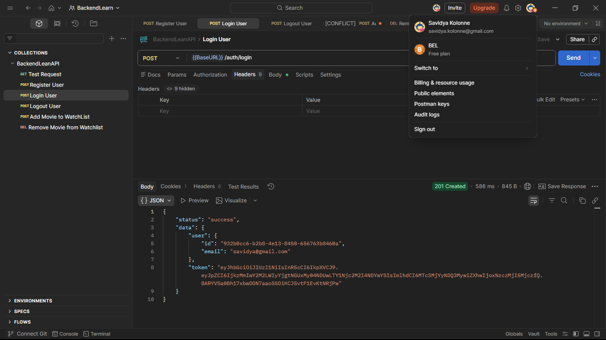

# 🎬 BackendLeanAPI

A RESTful backend API for user authentication and movie watchlist management.
Built with Node.js, Express, and Prisma.

---

<p align="center">
  
</p>

## 🚀 Features

* User registration
* User login & logout
* JWT authentication
* Add movie to watchlist
* Remove movie from watchlist
* Protected routes
* Prisma ORM with migrations

---

## 🛠️ Tech Stack

* Node.js
* Express.js
* Prisma ORM
* PostgreSQL
* JWT Authentication
* REST API

---

## 📂 Project Structure

```
backend/
│
├── prisma/
│   ├── migrations/          # Database migration files
│   └── schema.prisma        # Prisma schema
│
├── src/
│   ├── config/
│   │   └── db.js            # Database configuration
│   │
│   ├── controllers/
│   │   └── authController.js
│   │
│   ├── routes/
│   │   ├── authRoutes.js
│   │   └── movieRoutes.js
│   │
│   ├── utils/
│   │   └── generateToken.js
│   │
│   └── server.js            # Entry point
│
├── .env                     # Environment variables
├── package.json
├── package-lock.json
└── prisma.config.ts
```

---

## ⚙️ Installation

Clone the repo:

```bash
git clone <your-repo-url>
cd backend
```

Install dependencies:

```bash
npm install
```

---

## 🔐 Environment Variables

Create a `.env` file in the root and add:

```
DATABASE_URL=your_database_url
JWT_SECRET=your_secret_key
PORT=5000
```

---

## 🗄️ Run Prisma Migrations

```bash
npx prisma migrate dev
```

---

## ▶️ Run the Server

```bash
npm run dev
```

or

```bash
node src/server.js
```

Server will run on:

```
http://localhost:5000
```

---

## 📬 API Endpoints

### Auth

* `POST /api/auth/register`
* `POST /api/auth/login`
* `POST /api/auth/logout`

### Watchlist

* `POST /api/movies`
* `DELETE /api/movies/:id`

---

## 🧠 Future Improvements

* Input validation middleware
* Global error handler
* Role-based authentication
* API documentation with Swagger
* Unit testing

---

## 👨‍💻 Author

Built as part of backend learning journey.

---

## 📄 License

This project is open-source and available under the MIT License.
